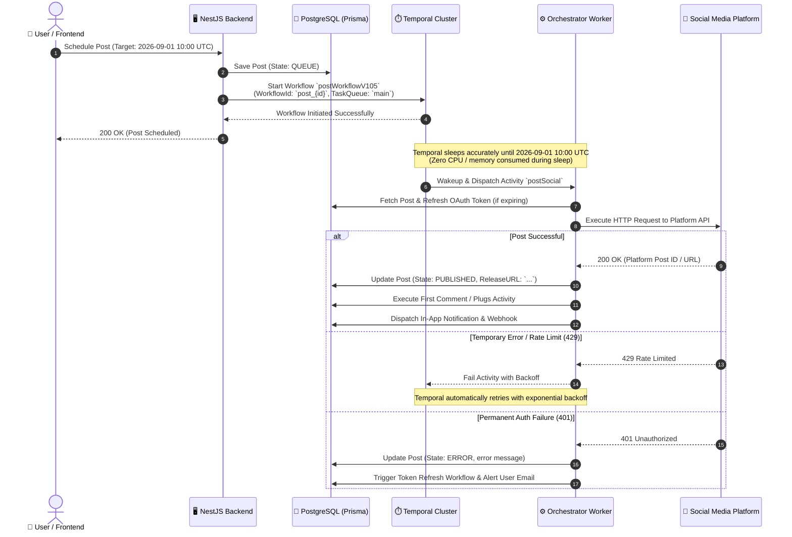
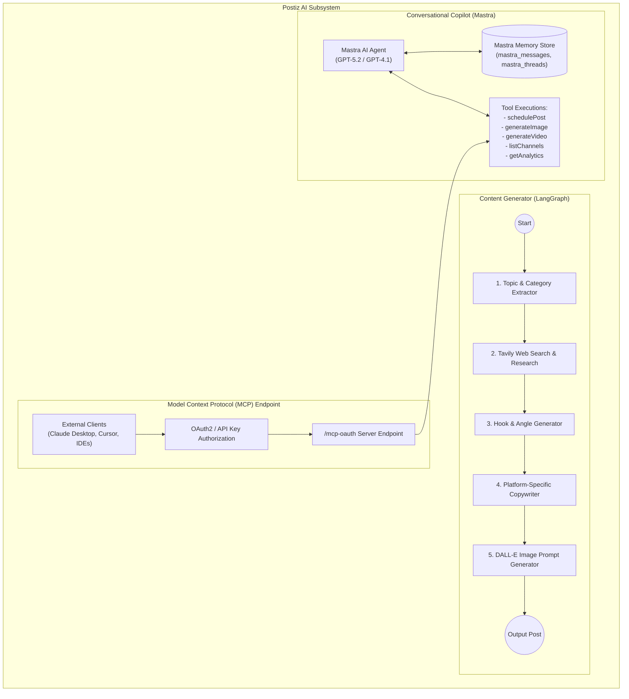
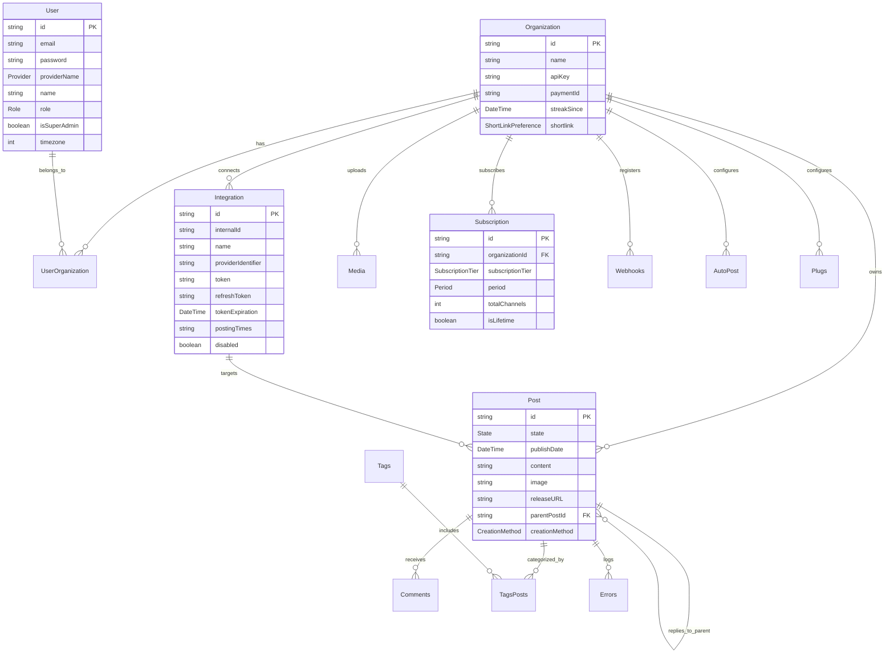

# 📘 Complete Codebase & System Architecture Analysis
## Postiz (Gitroom) — Enterprise Social Media Management & Automation Platform

---

> **Document Type**: Technical Deep Dive & Product Blueprint  
> **Target Audience**: Developers, Software Architects, and Product Founders  
> **Source Repository**: `postiz-app-main` (Gitroom / Postiz)  
> **License**: AGPL-3.0  
> **Workspace Engine**: PNPM Monorepo  

---

## 📑 Table of Contents

1. [Executive Summary & Core Product Concept](#1-executive-summary--core-product-concept)
2. [High-Level System Architecture & Flow](#2-high-level-system-architecture--flow)
3. [Repository Structure (Monorepo Breakdown)](#3-repository-structure-monorepo-breakdown)
4. [Complete Technology Stack & Library Inventory](#4-complete-technology-stack--library-inventory)
   - [4.1 Backend Framework & Utilities](#41-backend-framework--utilities)
   - [4.2 Frontend Stack & UI Componentry](#42-frontend-stack--ui-componentry)
   - [4.3 Database, ORM & Caching](#43-database-orm--caching)
   - [4.4 Background Job & Workflow Orchestration (Temporal)](#44-background-job--workflow-orchestration-temporal)
   - [4.5 Artificial Intelligence & Agentic Stack](#45-artificial-intelligence--agentic-stack)
   - [4.6 Media Storage, Processing & Design Studio](#46-media-storage-processing--design-studio)
   - [4.7 Billing, Payments & Subscriptions](#47-billing-payments--subscriptions)
   - [4.8 Authentication, Authorization & Security](#48-authentication-authorization--security)
   - [4.9 Observability, Analytics & Error Tracking](#49-observability-analytics--error-tracking)
5. [External Tools, Third-Party Systems & Infrastructure](#5-external-tools-third-party-systems--infrastructure)
6. [Deep-Dive: Social Media & Channel Integrations (30+ Channels)](#6-deep-dive-social-media--channel-integrations-30-channels)
7. [Durable Background Execution (Temporal Engine)](#7-durable-background-execution-temporal-engine)
8. [AI Agent, CopilotKit & MCP Architecture](#8-ai-agent-copilotkit--mcp-architecture)
9. [Database Schema & Domain Entity Models](#9-database-schema--domain-entity-models)
10. [Commercial SaaS Productization Blueprint](#10-commercial-saas-productization-blueprint)

---

## 1. Executive Summary & Core Product Concept

**Postiz** is an open-source, enterprise-grade social media scheduling, automation, management, and marketing platform designed to handle multi-channel publishing to over **30+ social networks, blogs, communication channels, and Web3 platforms**.

### Key Value Propositions:
- **Unified Social Inbox & Calendar**: Schedule single posts, carousel threads, Reels, Shorts, and long-form articles across multiple platforms simultaneously.
- **Durable Scheduling Engine**: Powered by **Temporal.io**, ensuring scheduled posts survive server restarts, long delays, rate limits, and network errors without lost jobs or drift.
- **In-App Creative Suite**: Includes an interactive Canva-style graphic editor (**Polotno**), rich text editor (**TipTap v3**), AI image generator (DALL-E), and AI video generators (HeyGen, Reelfarm, Veo3).
- **Agentic AI & Copilot**: Native integration of **Mastra AI**, **LangChain/LangGraph**, and **CopilotKit** for intelligent content generation, web-grounded research (Tavily), and Model Context Protocol (**MCP**) server endpoints allowing external AI assistants (e.g., Claude Desktop, Cursor) to manage social accounts.
- **Smart Growth Automation**: "Plugs" system for automatic first-comment follow-ups, auto-posting from RSS feeds, automatic token refreshers, and multi-tenant team management with Stripe billing.

---

## 2. High-Level System Architecture & Flow

```mermaid
graph TB
    subgraph Client_Layer ["Client & Interface Layer"]
        WEB["🌐 Web Application<br/>(Next.js 16 + React 19 + SWR)"]
        EXT["🔌 Browser Extension<br/>(Vite + CRXJS + WebExtension API)"]
        SDK["📦 Postiz Node SDK<br/>(@gitroom/sdk)"]
        MCP_CLI["🤖 AI Agents & MCP Clients<br/>(Claude Desktop / Cursor / Mastra)"]
    end

    subgraph Gateway ["Reverse Proxy / Load Balancer"]
        PROXY["⚖️ Nginx / Traefik / Docker Port 4007"]
    end

    subgraph App_Layer ["Application Services Layer (Node >=22)"]
        API["🖥️ NestJS Backend API (Port 3000)<br/>- REST Endpoints<br/>- Public API v1<br/>- Auth & OAuth2 Server<br/>- MCP Protocol Server"]
        ORC["⚙️ Temporal Worker Orchestrator<br/>- Post Publishing Workflows<br/>- Token Refresh Workflows<br/>- RSS Autopost Workflows<br/>- Daily Digest Workflows"]
        CLI["💻 CLI Command Runner<br/>- Agent tasks, Config checkers"]
    end

    subgraph AI_Engine ["AI & Content Generation Engine"]
        MASTRA["🧠 Mastra Agent & Memory Store"]
        LANGGRAPH["📊 LangGraph Multi-step State Pipeline"]
        COPILOT["💬 CopilotKit In-App Assistant"]
        TAVILY_API["🔍 Tavily Web Search API"]
        OPENAI_API["✨ OpenAI GPT-4.1 / GPT-5.2 / DALL-E"]
    end

    subgraph Data_Storage ["Data & Cache Infrastructure"]
        PG[("🐘 PostgreSQL 16/17<br/>Prisma ORM (Multi-tenant DB)")]
        REDIS[("⚡ Redis 7.2<br/>Cache, Session & Rate Limiter")]
        S3[("🪣 S3 / Cloudflare R2<br/>Media Uploads & Static Assets")]
        TEMPORAL_SRV[("⏱️ Temporal Server (7233)<br/>Elasticsearch + Postgres Engine")]
    end

    subgraph External_APIs ["External Social & SaaS Services"]
        SOCIAL_APIS["📱 30+ Social Networks<br/>(X, Meta, LinkedIn, TikTok, YouTube, Bluesky, etc.)"]
        STRIPE_SVC["💳 Stripe Connect & Subscriptions"]
        RESEND_SVC["📧 Resend / SMTP Email Service"]
        SENTRY_SVC["🐛 Sentry & Sentry Spotlight (8969)"]
        SHORT_LINKS["🔗 Dub.co / Short.io / Kutt / LinkDrip"]
    end

    WEB --> PROXY
    EXT --> PROXY
    SDK --> PROXY
    MCP_CLI --> PROXY

    PROXY --> API
    PROXY --> WEB

    API --> PG
    API --> REDIS
    API --> S3
    API --> TEMPORAL_SRV
    API --> AI_Engine
    API --> STRIPE_SVC
    API --> RESEND_SVC
    API --> SENTRY_SVC

    ORC --> PG
    ORC --> REDIS
    ORC --> TEMPORAL_SRV
    ORC --> SOCIAL_APIS
    ORC --> SHORT_LINKS
    ORC --> RESEND_SVC

    AI_Engine --> OPENAI_API
    AI_Engine --> TAVILY_API

    style Client_Layer fill:#0f172a,stroke:#38bdf8,color:#f8fafc
    style App_Layer fill:#0f172a,stroke:#10b981,color:#f8fafc
    style AI_Engine fill:#0f172a,stroke:#ec4899,color:#f8fafc
    style Data_Storage fill:#0f172a,stroke:#8b5cf6,color:#f8fafc
    style External_APIs fill:#0f172a,stroke:#f59e0b,color:#f8fafc
```



---

## 3. Repository Structure (Monorepo Breakdown)

Postiz uses a **PNPM Workspace** monorepo setup organized cleanly into runtime `apps` and reusable `libraries`:

```
postiz-app-main/
├── apps/
│   ├── backend/               # Core NestJS REST API, Auth, Public API, Webhooks, MCP server
│   ├── frontend/              # Next.js 16 Web Application (App Router, Tailwind, TipTap, Polotno)
│   ├── orchestrator/          # Temporal.io Worker application executing resilient workflows & activities
│   ├── extension/             # Chromium/Firefox Browser Extension (Vite + CRXJS) for fast posting & cookie auth
│   ├── commands/              # NestJS CLI task runner for maintenance, cron commands, token refresh
│   └── sdk/                   # Node.js Public API SDK package (bundled via tsup)
│
├── libraries/
│   ├── nestjs-libraries/      # Shared backend domain modules:
│   │   ├── database/          # Prisma schema, repositories (Posts, Integrations, Users, Orgs, etc.)
│   │   ├── integrations/      # 30+ Social media provider implementations & token managers
│   │   ├── agent/             # LangGraph multi-step content generation pipelines
│   │   ├── chat/              # Mastra AI agent, tools definition, and MCP OAuth2 server
│   │   ├── upload/            # Local storage & Cloudflare R2/S3 file uploader engines
│   │   ├── short-linking/     # URL shortener abstractions (Dub, Short.io, Kutt, LinkDrip)
│   │   ├── 3rdparties/        # Video & avatar generators (HeyGen, Reelfarm)
│   │   ├── videos/            # Image-to-video / Google Veo3 generation engine
│   │   ├── videos/            # Image-to-video / Google Veo3 generation engine
│   │   ├── services/          # Stripe billing, email dispatcher (Resend/Nodemailer)
│   │   ├── temporal/          # Temporal client module registration & search attributes
│   │   ├── throttler/         # Redis-backed rate limiting
│   │   └── sentry/            # Sentry tracing and error reporting setup
│   │
│   ├── react-shared-libraries/# Shared frontend utilities, form resolvers, toasts, i18n hooks
│   └── helpers/               # Shared cross-runtime helpers (auth decorators, custom fetch, swagger, sanitize)
│
├── dynamicconfig/             # Temporal server dynamic configuration (development-sql.yaml)
├── docs/                      # Technical specifications, PRDs, and architecture blueprints
├── docker-compose.yaml        # Full production stack (Postgres, Redis, Temporal, ES, Spotlight, Postiz)
├── docker-compose.dev.yaml    # Development dependencies stack (Postgres, Redis, Temporal)
└── package.json               # Root monorepo dependency declaration
```

---

## 4. Complete Technology Stack & Library Inventory

Every single tier in this project is built on modern, battle-tested technologies. Below is the comprehensive classification of all libraries and packages used:

### 4.1 Backend Framework & Utilities

| Package | Version | Purpose & Usage in Codebase |
|---|---|---|
| `@nestjs/core`, `@nestjs/common` | `^11.1.21` | Modern enterprise backend framework for controllers, dependency injection, and modular architecture. |
| `@nestjs/platform-express` | `^11.1.21` | Express HTTP adapter underlying the NestJS API application. |
| `@nestjs/swagger` | `^11.4.3` | Auto-generates OpenAPI / Swagger interactive documentation at `/api/docs`. |
| `@nestjs/throttler` | `^6.5.0` | IP and token-based rate limiting on API routes to prevent spam and abuse. |
| `@nest-lab/throttler-storage-redis` | `^1.2.0` | Distributed Redis storage for rate limiting across multi-instance clusters. |
| `@nestjs/schedule` | `^6.1.3` | Internal cron scheduling triggers for system maintenance routines. |
| `@nestjs/microservices` | `^11.1.21` | Distributed microservice communication capabilities. |
| `nestjs-command` | `^3.1.4` | CLI command framework power for the `apps/commands` executable. |
| `nestjs-real-ip` | `^3.0.1` | Reliable client IP detection through reverse proxies and Cloudflare headers. |
| `class-validator` & `class-transformer` | `^0.14.1` / `^0.5.1` | Request DTO schema validation and payload transformation. |
| `class-validator-jsonschema` | `^5.1.0` | Converts class-validator DTOs into JSON Schemas for dynamic tool inputs. |
| `compression` | `^1.8.1` | Gzip/Brotli HTTP response compression middleware for high throughput. |
| `cookie-parser` | `^1.4.7` | Parses session cookies for web and extension authentication. |
| `axios` | `^1.14.0` | HTTP client for external third-party social media and REST API communications. |
| `bottleneck` | `^2.19.5` | Strict task rate limiter and concurrent request throttling for third-party social APIs. |
| `async-mutex` | `^0.5.0` | Mutex locks ensuring atomic operations during token refreshes. |
| `rss-parser` | `^3.13.0` | Parses RSS/Atom feeds to automatically convert blog articles into scheduled social posts. |

---

### 4.2 Frontend Stack & UI Componentry

| Package | Version | Purpose & Usage in Codebase |
|---|---|---|
| `next` | `16.2.6` | Next.js 16 App Router framework for fast server-side rendering, routing, and asset loading. |
| `react` & `react-dom` | `19.2.4` | React 19 core library utilizing modern hooks, actions, and server components. |
| `tailwindcss` | `3.4.17` | Utility-first CSS styling framework with custom design tokens (`colors.scss`). |
| `tailwind-scrollbar` & `tailwindcss-rtl` | `^3.1.0` / `^0.9.0` | Custom scrollbar theming and Right-to-Left (RTL) internationalization layout support. |
| `@mantine/core`, `@mantine/dates`, `@mantine/hooks`, `@mantine/modals` | `^5.10.5` | Headless & styled UI primitives for calendar datepickers, modals, dropdowns, and notifications. |
| `@tiptap/react` & `@tiptap/starter-kit` | `^3.0.6` | TipTap v3 rich-text editor for social media post composition with mention and link extensions. |
| `polotno` | `^3.0.0-beta.25` | Canvas-based graphic design studio (Canva alternative) directly embedded for image creation. |
| `swr` | `^2.2.5` | Stale-While-Revalidate data fetching, cache synchronization, and optimistic UI updates. |
| `zustand` | `^5.0.5` | Lightweight global client state management for modals, current org, and editor draft state. |
| `react-hook-form` & `@hookform/resolvers` | `^7.58.1` / `^3.3.4` | High-performance form state management with Zod schema resolution. |
| `react-dnd` & `react-dnd-html5-backend` | `^16.0.1` | HTML5 Drag & Drop engine for dragging posts across the visual scheduling calendar. |
| `react-sortablejs` | `^6.1.4` | Drag-and-drop sortable lists for re-ordering thread posts and media galleries. |
| `sweetalert2` & `@sweetalert2/theme-dark` | `11.4.8` / `^5.0.16` | Styled dark-mode confirmation dialogs for destructive actions. |
| `emoji-picker-react` | `^4.12.0` | Native emoji search and insertion picker in post composers. |
| `react-colorful` | `^5.6.1` | Hex/RGB color picker component for custom post branding and tag colors. |
| `@meronex/icons` | `^4.0.0` | Complete collection of icons (Feather, FontAwesome, Tabler, Material). |
| `i18next` & `react-i18next` | `^25.2.1` / `^15.5.2` | Comprehensive multi-language localization framework. |

---

### 4.3 Database, ORM & Caching

| Package | Version | Purpose & Usage in Codebase |
|---|---|---|
| `@prisma/client` & `prisma` | `6.5.0` | Type-safe PostgreSQL ORM for schema migration, relations, indexing, and transactional operations. |
| `ioredis` & `redis` | `^5.3.2` / `^4.6.12` | High-speed in-memory data store for caching, rate limiting, and temporary locks. |
| `postgresql` (Docker: `postgres:17-alpine`) | `17.x` | Primary relational database housing organizations, posts, users, analytics, and integrations. |

---

### 4.4 Background Job & Workflow Orchestration (Temporal)

| Package | Version | Purpose & Usage in Codebase |
|---|---|---|
| `@temporalio/client` | `^1.14.0` | Initiates, signals, queries, and schedules durable workflows from the NestJS backend. |
| `@temporalio/worker` | `^1.14.0` | Long-running worker process in `apps/orchestrator` executing activities and state machines. |
| `@temporalio/workflow` & `@temporalio/activity` | `^1.14.0` | Core SDK for writing deterministic workflow logic (`sleep`, `startChild`, `defineSignal`) and activities. |
| `nestjs-temporal-core` | `^3.2.0` | NestJS module decorators (`@Activity()`, `@ActivityMethod()`) for dependency-injected Temporal services. |
| `elasticsearch` (Docker: `elasticsearch:7.17.27`) | `7.17` | Search index backing Temporal Server for querying custom search attributes (`postId`, `organizationId`). |

---

### 4.5 Artificial Intelligence & Agentic Stack

| Package | Version | Purpose & Usage in Codebase |
|---|---|---|
| `@mastra/core` & `@mastra/memory` | `^1.21.0` / `^1.13.0` | Agent framework with persistent conversational memory, structured output generation, and tool execution. |
| `@mastra/mcp` & `@modelcontextprotocol/sdk` | `^1.4.1` / `^1.22.0` | Implements Model Context Protocol (MCP) server endpoints allowing LLM agents to orchestrate Postiz. |
| `@copilotkit/react-core` & `@copilotkit/runtime` | `1.10.6` | In-app Copilot assistant providing context-aware social post suggestions and chat interface. |
| `@copilotkit/react-textarea` | `1.10.6` | AI-assisted autocomplete textarea for social media copywriting. |
| `@langchain/langgraph` | `^1.2.8` | Stateful multi-agent graph pipeline executing research, topic generation, hook generation, and writing. |
| `@langchain/core` & `@langchain/openai` | `^1.1.39` / `^1.4.3` | LangChain abstractions connecting ChatOpenAI (`gpt-4.1`, `gpt-5.2`) and Dall-E image wrappers. |
| `@langchain/tavily` | `^1.2.0` | Real-time web search tool integration (Tavily) enabling AI to fetch fresh news and market data. |
| `@ai-sdk/openai` & `openai` | `^2.0.52` / `^6.2.0` | Official OpenAI TypeScript SDK for LLM completion calls and token streaming. |

---

### 4.6 Media Storage, Processing & Design Studio

| Package | Version | Purpose & Usage in Codebase |
|---|---|---|
| `@aws-sdk/client-s3` | `^3.787.0` | S3 client handling direct file uploads and signed URLs for S3 or Cloudflare R2 storage. |
| `@aws-sdk/s3-request-presigner` | `^3.787.0` | Generates pre-signed upload URLs for secure, direct client-to-storage uploads. |
| `@uppy/core`, `@uppy/react`, `@uppy/aws-s3` | `^4.4.6` / `^4.3.0` | Modular file uploader with drag-and-drop, image compression, and S3 multipart chunked uploads. |
| `sharp` | `^0.33.4` | High-performance C-lib Vips image resizing, aspect-ratio cropping, format conversion (WebP/PNG). |
| `canvas` | `^2.11.2` | Node.js Cairo-backed canvas engine for server-side image rendering and text overlays. |
| `multer` | `^1.4.5-lts.1` | Multipart/form-data handler for server-side media uploads. |
| `music-metadata` & `subtitle` | `^7.14.0` / `4.2.2` | Audio/video duration extraction, audio bitrate verification, and subtitle parser. |

---

### 4.7 Billing, Payments & Subscriptions

| Package | Version | Purpose & Usage in Codebase |
|---|---|---|
| `stripe` | `^20.4.0` | Backend Stripe API SDK for managing checkout sessions, customer portals, and webhooks. |
| `@stripe/stripe-js` & `@stripe/react-stripe-js` | `^8.6.0` / `^5.4.1` | Client-side Stripe Elements for credit card collection and subscription upgrades. |

---

### 4.8 Authentication, Authorization & Security

| Package | Version | Purpose & Usage in Codebase |
|---|---|---|
| `jsonwebtoken` | `^9.0.2` | Issues and verifies signed JWT tokens with multi-tenant organization payloads. |
| `bcrypt` | `^5.1.1` | Cryptographic salted password hashing for email/password authentication. |
| `@casl/ability` | `^6.5.0` | Attribute-based Role Access Control (RBAC) governing roles: `SUPERADMIN`, `ADMIN`, `USER`. |
| `google-auth-library` & `googleapis` | `^9.11.0` / `^137.1.0` | Google Sign-in authentication and YouTube Data API v3 OAuth flows. |
| `twitter-api-v2` | `^1.29.0` | Twitter OAuth 2.0 PKCE authentication and v2 tweet management. |
| `@atproto/api` | `^0.15.15` | AT Protocol client for Bluesky decentralized authentication and posting. |
| `@neynar/nodejs-sdk` & `@neynar/react` | `^3.112.0` / `^1.2.22` | Farcaster decentralized social login and cast publication. |
| `nostr-tools` | `^2.18.2` | Nostr cryptographic keypair management and NIP-01 relay event signing. |
| `@solana/wallet-adapter-react` & `viem` | `^0.15.35` / `^2.22.9` | Web3 wallet connection adapters (Phantom, MetaMask) for decentralized identity sign-in. |
| `isomorphic-dompurify` & `striptags` | `^3.10.0` / `^3.2.0` | Cleanses user-submitted HTML to prevent Cross-Site Scripting (XSS) and SSRF exploits. |

---

### 4.9 Observability, Analytics & Error Tracking

| Package | Version | Purpose & Usage in Codebase |
|---|---|---|
| `@sentry/nestjs`, `@sentry/nextjs`, `@sentry/react` | `^10.26.0` | Distributed error capture, performance transactions, and session replay across backend and frontend. |
| `@sentry/profiling-node` | `^10.25.0` | Real-time CPU and memory call-stack profiling in production. |
| `posthog-js` | `^1.178.0` | Product analytics, user funnels, feature flags, and cohort tracking. |
| `next-plausible` | `^3.12.0` | Privacy-focused lightweight page view analytics. |

---

## 5. External Tools, Third-Party Systems & Infrastructure

When self-hosting or deploying Postiz as a commercial product, the following external infrastructure systems and SaaS services are leveraged:

```mermaid
graph LR
    subgraph Core_Infra ["Core Infrastructure Containers"]
        P_PG["🐘 PostgreSQL 17"]
        P_RD["⚡ Redis 7.2"]
        T_PG["🐘 Temporal PostgreSQL"]
        T_ES["🔎 Elasticsearch 7.17"]
        T_SRV["⏱️ Temporal Engine 1.28"]
        T_UI["🖥️ Temporal Web UI (8080)"]
    end

    subgraph Cloud_SaaS ["External Cloud & SaaS Services"]
        S_R2["☁️ Cloudflare R2 / AWS S3<br/>(Media Storage)"]
        S_RES["✉️ Resend / SendGrid<br/>(Transactional Email)"]
        S_STR["💳 Stripe<br/>(Billing & Invoicing)"]
        S_OAI["🧠 OpenAI<br/>(GPT-4/5, DALL-E)"]
        S_TAV["🔍 Tavily<br/>(Real-time Research)"]
        S_SNT["🐛 Sentry.io<br/>(Telemetry & Profiling)"]
        S_SHR["🔗 Dub.co / Short.io<br/>(Link Click Analytics)"]
    end

    Core_Infra -.-> Cloud_SaaS
```



### Infrastructure Components:
1. **PostgreSQL**: Stores relational application state (multi-tenant schemas, users, posts, media links, comments, webhooks).
2. **Redis**: Used for API rate-limiting via `@nest-lab/throttler-storage-redis`, distributed caching, and fast lookup of active sessions.
3. **Temporal.io Stack**:
   - **Temporal Server (`temporalio/auto-setup:1.28.1`)**: Orchestrates workflow state machines and schedules.
   - **Temporal Elasticsearch (`elasticsearch:7.17.27`)**: Powers Temporal Advanced Visibility to search workflows by `postId` or `organizationId`.
   - **Temporal PostgreSQL**: Dedicated relational database for Temporal cluster execution logs.
   - **Temporal UI (`temporalio/ui:2.34.0`)**: Web dashboard on port `8080` for monitoring running workflows and retrying failed activities.
4. **Cloudflare R2 / AWS S3**: Object storage for user media, video uploads, profile pictures, and generated graphics.
5. **Resend / SMTP**: Dispatches email activations, invitation links, weekly digest metrics, and post failure alerts.
6. **Stripe**: Handles SaaS subscription tiers, credit packs for AI image/video generation, and Stripe Connect.
7. **Sentry Spotlight**: Local developer debugging dashboard (`ghcr.io/getsentry/spotlight`) running on port `8969`.
8. **Short-Link Providers**: Dub.co, Short.io, Kutt.it, or LinkDrip for link shortening and real-time click tracking.

---

## 6. Deep-Dive: Social Media & Channel Integrations (30+ Channels)

Postiz features one of the most comprehensive social integration suites in the open-source ecosystem. All providers extend `SocialAbstract` (`libraries/nestjs-libraries/src/integrations/social.abstract.ts`).

Below is the complete architectural matrix of supported channels:

```
                               ┌─── Major Socials (X, Facebook, Instagram, Threads, LinkedIn, TikTok, YouTube, Pinterest)
                               ├─── Developer & Tech (Dev.to, Hashnode, Medium, GitHub, WordPress)
Social Integration Architecture ─── Chat & Community (Discord, Slack, Telegram, Reddit, Lemmy, Skool, Whop)
                               ├─── Web3 & Decentralized (Bluesky, Mastodon, Farcaster, Nostr)
                               └─── Video & Streaming (Twitch, Kick, Dribbble, Tumblr, VK)
```

| Channel / Platform | API & Library Protocol | Auth Mechanism | Special Capabilities & Constraints |
|---|---|---|---|
| **X (Twitter)** | Twitter API v2 (`twitter-api-v2`) | OAuth 2.0 PKCE | Multi-tweet threads, video/image attachments, poll support, character length validation (280 standard / 25k Premium). |
| **Facebook** | Meta Graph API v21 (`facebook-nodejs-business-sdk`) | OAuth 2.0 (Page Access Token) | Publishes to Facebook Pages & Groups, single images, carousels, video reels, first comments. |
| **Instagram** | Meta Graph API (Instagram Graph) | OAuth 2.0 via Facebook Page | Feed single image, multi-image carousel (up to 10), Reels, Stories, automated first-comment hashtags. |
| **Threads** | Meta Threads API | OAuth 2.0 | Text threads, carousel photos, reply chains, direct links. |
| **LinkedIn (Profile & Page)** | LinkedIn Community Management API | OAuth 2.0 | Text posts, single/multiple images, PDF document carousels, poll creation, first comments. |
| **TikTok** | TikTok Content Posting API | OAuth 2.0 | Direct video publishing, privacy level configuration, duet/stitch permissions, cover photo selection. |
| **YouTube** | Google Data API v3 (`googleapis`) | OAuth 2.0 | Uploads long-form YouTube Videos and YouTube Shorts, privacy status (Public/Unlisted), custom thumbnails. |
| **Pinterest** | Pinterest API v5 | OAuth 2.0 | Pin creation, board selection, custom destination URL linking, image pins. |
| **Reddit** | Reddit API | OAuth 2.0 | Subreddit targeting, link posts, self-text markdown posts, image/video galleries, flair selection. |
| **Bluesky** | AT Protocol (`@atproto/api`) | App Password / ATProto OAuth | Decentralized microblogging, multi-post thread reply trees, facet rich links, image blobs. |
| **Mastodon** | Mastodon REST API v1 | OAuth 2.0 / Access Token | Supports `mastodon.social` or any custom self-hosted Mastodon instance, content warning (CW) flags, federated statuses. |
| **Farcaster** | Neynar API (`@neynar/nodejs-sdk`) | Neynar Signer UUID | Web3 decentralized social casts, channel tagging, embedded frames and images. |
| **Nostr** | Nostr NIP-01 (`nostr-tools`) | Private Key (nsec / hex) | Signs NIP-01 text notes and publishes them to configured Nostr relays. |
| **Discord** | Discord Webhook & Bot API (`discord.js`) | Bot Token / Webhook URL | Message broadcasting to designated channels, embeds, file attachments. |
| **Slack** | Slack Web API | OAuth 2.0 Bot Token | Channels, rich block formatting, team updates. |
| **Telegram** | Telegram Bot API (`node-telegram-bot-api`) | Bot Token + Channel ID | Channel broadcasts, group notifications, markdown formatting, photo/video captions. |
| **Medium** | Medium REST API | Integration Token | Long-form story publication, canonical link attribution, tags, publication targeting. |
| **Dev.to** | Forem API | Personal API Key | Markdown technical articles, tags, organization publication, series attribution. |
| **Hashnode** | Hashnode GraphQL API | Personal Access Token | Headless blog publication, custom slugs, subtitle, canonical URLs, publication ID mapping. |
| **WordPress** | WP REST API v2 | Application Password | Self-hosted or WordPress.com posts, categories, tags, featured media upload. |
| **Google Business (GMB)** | Google My Business API | OAuth 2.0 | Local business updates, call-to-action buttons (Call, Learn More, Book), photo updates. |
| **Skool** | Skool Community API | Extension Cookie Auth | Posts to Skool classroom/community groups using browser session tokens. |
| **Lemmy** | Lemmy HTTP API | Username & Password / Token | Community post submission on federated Lemmy instances. |
| **Listmonk** | Listmonk Newsletter API | HTTP Basic / API Key | Dispatches email campaigns and newsletters to subscriber lists. |
| **Tumblr** | Tumblr API v2 | OAuth 1.0a / 2.0 | Photo posts, text blogs, link shares with tags. |
| **Dribbble** | Dribbble API | OAuth 2.0 | Design shot uploads, project categorization. |
| **Twitch & Kick** | Twitch / Kick APIs | OAuth 2.0 / Webhook | Live stream start announcements and community updates. |
| **VK (VKontakte)** | VK API | OAuth 2.0 | Wall posts, community broadcasts. |
| **Whop** | Whop API | API Key | Digital product updates and announcements. |

---

## 7. Durable Background Execution (Temporal Engine)

Traditional background queue architectures (like BullMQ or Celery) struggle with social media scheduling because jobs scheduled 30 days into the future are vulnerable to Redis eviction, database restarts, and timer drift.

Postiz solves this with **Temporal.io**:



### Temporal Advantages in Postiz:
1. **Reliable Sleeps**: `await sleep(publishDate - now)` handles days or weeks of waiting deterministically.
2. **Interactive Signals (`poke`)**: If a user clicks "Post Now", the API sends a `poke` signal to the workflow, instantly breaking the sleep cycle and executing immediately.
3. **Workflow Versioning (`postWorkflowV101` to `postWorkflowV105`)**: When post logic changes, older in-flight workflows complete on their original version without breaking.
4. **Dynamic Task Queues**: Each social network (e.g., `x`, `facebook`, `linkedin`) can run on dedicated task queues with custom concurrency limits to prevent global rate-limit bans.

---

## 8. AI Agent, CopilotKit & MCP Architecture

Postiz incorporates an advanced AI subsystem combining **Mastra AI**, **LangGraph**, and **Model Context Protocol (MCP)**:



### Key AI Features:
- **LangGraph State Graph**: Multi-step stateful generation pipeline (`agent.graph.service.ts`) that executes deep research using Tavily before writing hooks, body copy, and image prompts tailored for each platform's character limits.
- **Mastra AI & Persistent Working Memory**: Maintains session threads in PostgreSQL (`mastra_messages`, `mastra_resources`, `mastra_threads`), allowing the AI assistant to remember brand guidelines and past conversations.
- **Model Context Protocol (MCP) Server**: Implements an OAuth2-protected MCP server (`start.mcp.ts`), enabling users to connect their Postiz account into AI tools like Claude Desktop to execute commands like: *"Schedule a 5-tweet thread about our product release for tomorrow at 2 PM with an AI-generated image."*

---

## 9. Database Schema & Domain Entity Models

The database schema (`libraries/nestjs-libraries/src/database/prisma/schema.prisma`) comprises **30+ models**. Below are the key core entities and their relationships:



---

## 10. Commercial SaaS Productization Blueprint

If you are planning to build a **commercial, proprietary SaaS product** based on this open-source architecture, follow this structured roadmap:

### 10.1 Branding & White-Labeling Strategy
- **Rename & Theming**: Update branding tokens in `apps/frontend/src/app/colors.scss` and `tailwind.config.cjs`.
- **Custom Domain Mapping**: Enable CNAME custom domain mapping for agencies to offer white-labeled social management to their clients.
- **Dedicated OAuth Apps**: Register developer applications under your company name for Twitter/X, Meta (Facebook/Instagram), LinkedIn, TikTok, and Google to show your own brand on authorization screens.

### 10.2 Monetization & Pricing Models
1. **Tiered Subscription Plans (via Stripe)**:
   - **Starter**: 1 User, 5 Social Channels, 50 Scheduled Posts/mo.
   - **Pro / Growth**: 3 Team Members, 15 Channels, Unlimited Posts, AI Copilot Access.
   - **Agency / Ultimate**: Unlimited Channels, Client Workspaces, White-label Reports, Custom Webhooks & MCP Access.
2. **AI Credits Consumption**:
   - Monitored via the `Credits` table (`type: "ai_images"`, `"ai_videos"`). Charge per DALL-E image or HeyGen/Veo3 video generation.
3. **Add-on Services**:
   - Short-link click tracking analytics (powered by Dub.co integration).
   - Social Media Agency Marketplace features (built into Postiz's `SocialMediaAgency` and `Orders` schema).

### 10.3 Security & Production Hardening
- **SSRF Protection**: Maintain Postiz's built-in `getSsrfSafeDispatcher` for self-hosted instances (e.g., WordPress, Mastodon) to prevent server-side request forgery into private VPC subnets.
- **Token Encryption**: Ensure all OAuth access tokens and refresh tokens stored in the `Integration` table are encrypted at rest using AES-256.
- **Worker Isolation**: In production Kubernetes/Docker clusters, run `apps/orchestrator` as independently scaled worker replicas separate from `apps/backend`.
- **Managed Temporal**: For mission-critical scale (>100,000 scheduled posts daily), consider switching from self-hosted Temporal to **Temporal Cloud** for zero-maintenance workflow durability.

---

### Summary Checklist for Launching Your Product:
1. ✅ **Database Migration**: Run `pnpm prisma-db-push` or `prisma migrate deploy` on PostgreSQL 17.
2. ✅ **Redis Setup**: Configure high-availability Redis 7.2 cluster for throttler rate-limiting.
3. ✅ **Temporal Cluster**: Deploy Temporal Server with PostgreSQL and Elasticsearch persistence.
4. ✅ **Storage Bucket**: Configure AWS S3 or Cloudflare R2 bucket with CORS for direct file uploads.
5. ✅ **Social App Credentials**: Obtain verified Client IDs & Secrets from Meta, X, LinkedIn, TikTok, and Google.
6. ✅ **Stripe Connect Webhooks**: Configure Stripe webhook secret to automatically activate subscriptions upon checkout.
7. ✅ **Deploy via Docker / Kubernetes**: Use the production multi-stage Docker build provided in the repository.

---
*Document generated for architectural reference and custom product development.*
